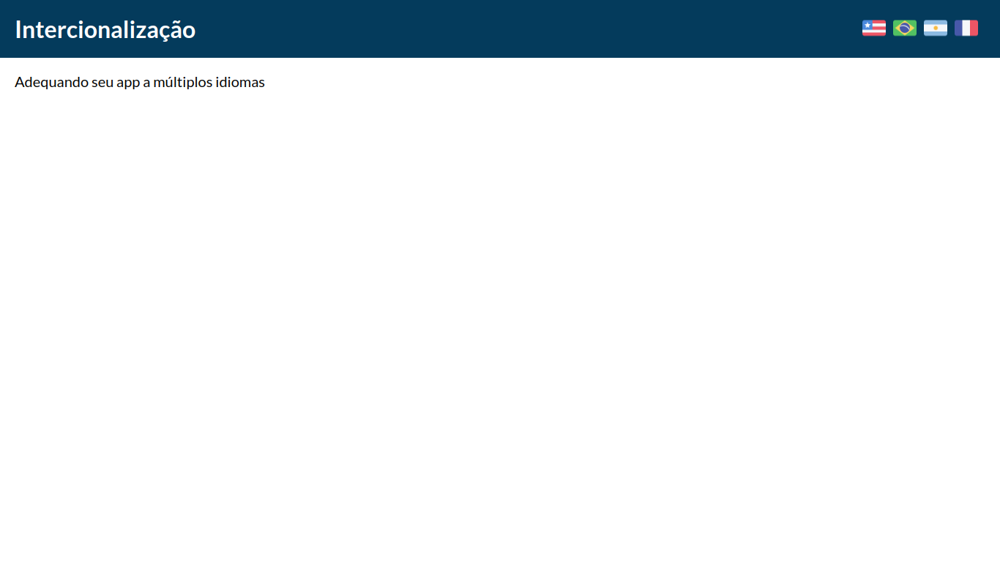
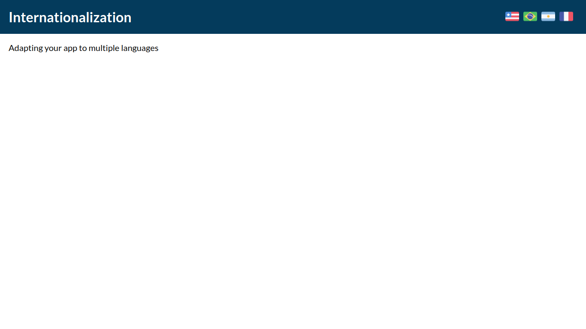
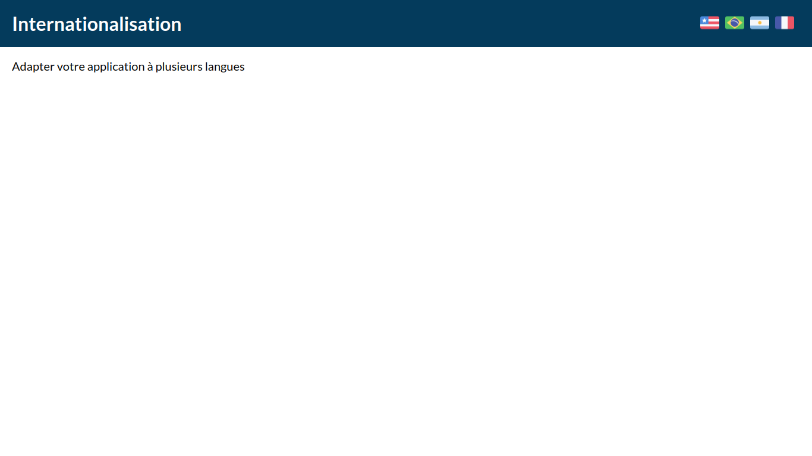
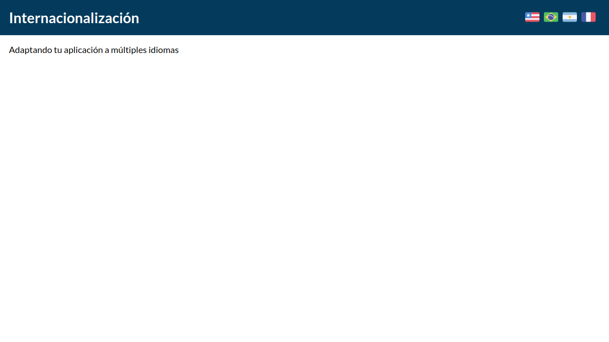

# exemplo-i18n

## Sumário

- [exemplo-i18n](#exemplo-i18n)
  - [Sumário](#sumário)
  - [Motivação](#motivação)
  - [Pilha de tecnologia](#pilha-de-tecnologia)
    - [Dependências importantes](#dependências-importantes)
  - [Galeria](#galeria)
  - [Como rodar](#como-rodar)
    - [Pré-requisitos](#pré-requisitos)
    - [Passo a passo](#passo-a-passo)

## Motivação

Este repositório de código consiste em uma demonstração do framework de internacionalização [i18n](https://www.i18next.com/), atualmente chamado de i18next. O nome i18n é uma abreviação que representa a palavra "internacionalização" seguida pelo número de letras entre a primeira e a última letra, "i18n". Esse framework é utilizado para tornar um app compatível com múltiplos idiomas, permitindo que os usuários possam escolher o idioma desejado.

Nesta demonstração, foram implementados suporte para os seguintes idiomas: português do Brasil (pt-BR), inglês dos Estados Unidos (en-US), francês da França (fr-FR) e espanhol da Argentina (es-AR). O objetivo é mostrar como é possível criar um app que se adapta ao idioma escolhido pelo usuário, proporcionando uma experiência localizada.

Este exemplo serve como ponto de partida para aqueles que desejam explorar as funcionalidades de internacionalização em aplicações e experimentar diferentes idiomas. Fique à vontade para navegar pelo diretório [`i18n`](./src/i18n/) e entender como as traduções são gerenciadas e como o app se adapta dinamicamente ao idioma selecionado.

Este foi o primeiro repositório de código apresentado no [Curso Superior de TSI do IFMS](https://www.ifms.edu.br/campi/campus-aquidauana/cursos/graduacao/sistemas-para-internet/sistemas-para-internet) como requisito para obtenção da nota parcial das atividades da unidade curricular Linguagem de Programação IV.

| [Próximo repositório &rarr;](#) |
|-|

## Pilha de tecnologia

| Papel | Tecnologia |
|-|-|
| Linguagem de programação | [TypeScript](typescriptlang.org) |
| Biblioteca de interface de usuário | [React](https://reactjs.org/) |
| Bundler | [create-react-app](https://create-react-app.dev/) |
| Framework de internacionalização | [i18next](https://www.i18next.com/) |

### Dependências importantes

As dependências abaixo são comumente utilizadas em projetos que requerem internacionalização (i18n), ou seja, a capacidade de fornecer suporte a diferentes idiomas e traduções em um app.

| Dependência | Descrição |
|-|-|
| [`i18next`](https://www.npmjs.com/package/i18next) | `i18next` é uma biblioteca de localização (tradução) para JavaScript. Ela fornece suporte para traduções em vários idiomas, substituição dinâmica de variáveis e muito mais. |
| [`i18next-browser-languagedetector`](https://www.npmjs.com/package/i18next-browser-languagedetector) | O `i18next-browser-languagedetector` é um plugin do i18next que permite detectar automaticamente o idioma preferido do usuário com base nas configurações do navegador. |
| [`react-i18next`](https://www.npmjs.com/package/react-i18next) | O `react-i18next` é uma biblioteca que fornece integração do i18next com o React. Ele oferece componentes e hooks que facilitam a tradução e localização de apps React. |

Os créditos pelas mídias utilizadas estão disponíveis [aqui](./src/assets/README.md).

## Galeria






## Como rodar

### Pré-requisitos

- [Node](https://nodejs.org/en/download/);
- [Yarn](https://yarnpkg.com/) (opcional).

### Passo a passo

1. Clone o repositório de código em sua máquina;
   
2. Abra um shell de comando de sua preferência (prompt de comando, PowerShell, terminal _etc_.);

3. Instale as dependências do projeto através do seguinte comando:

```console
$ npm install
```

Caso esteja utilizando o gerenciador de pacotes Yarn, execute o seguinte comando como alternativa:

```console
$ yarn
```

4. Finalmente, execute o seguinte comando para iniciar o app:

Para npm:

```console
$ npm run start
```

Para Yarn:

```console
$ yarn start
```